Single Cell Transcriptomics with Seurat
================
Júlia Perera-Bel (MARData-BU, Hospital del Mar Research Institute)

-   <a href="#introduction-to-single-cell-transcriptomics"
    id="toc-introduction-to-single-cell-transcriptomics">Introduction to
    Single Cell Transcriptomics</a>
    -   <a href="#preprocessing-with-cell-ranger"
        id="toc-preprocessing-with-cell-ranger">Preprocessing with Cell
        Ranger</a>
    -   <a href="#seurat" id="toc-seurat">Seurat</a>
-   <a href="#loading-data-and-initial-qc"
    id="toc-loading-data-and-initial-qc">Loading data and initial QC</a>
-   <a href="#normalization-and-scaling"
    id="toc-normalization-and-scaling">Normalization and Scaling</a>
-   <a href="#dimentionality-reduction"
    id="toc-dimentionality-reduction">Dimentionality reduction</a>
    -   <a href="#perform-linear-dimensional-reduction"
        id="toc-perform-linear-dimensional-reduction">Perform linear dimensional
        reduction</a>
    -   <a href="#determine-the-dimensionality-of-the-dataset"
        id="toc-determine-the-dimensionality-of-the-dataset">Determine the
        ‘dimensionality’ of the dataset</a>
    -   <a href="#run-non-linear-dimensional-reduction-umaptsne"
        id="toc-run-non-linear-dimensional-reduction-umaptsne">Run non-linear
        dimensional reduction (UMAP/tSNE)</a>
-   <a href="#integration" id="toc-integration">Integration</a>
-   <a href="#cell-clustering-and-annotation"
    id="toc-cell-clustering-and-annotation">Cell clustering and
    annotation</a>
    -   <a href="#use-reference-markers" id="toc-use-reference-markers">Use
        reference markers</a>
    -   <a href="#cell-type-classification-using-a-reference"
        id="toc-cell-type-classification-using-a-reference">Cell type
        classification using a reference</a>
    -   <a href="#findallmarkers" id="toc-findallmarkers">FindAllMarkers</a>
-   <a href="#differential-expression"
    id="toc-differential-expression">Differential expression</a>
    -   <a href="#findmarkers" id="toc-findmarkers">FindMarkers</a>
    -   <a href="#pseudobulk-differential-expression"
        id="toc-pseudobulk-differential-expression">Pseudobulk Differential
        Expression</a>

**WARNING: THIS TUTORIAL IS STILL UNDER CONSTRUCTION.** \# Requirements

This tutorial will be done with R with Seurat 5 R package.

Seurat depends on Matrix package. It is recommended to have Matrix
version higher than 1.5), which requires R ≥ 4.4.

Other packages will be used for visaulization, annotation and functional
enrichment

RStudio (or Visual Studio) is also recommended for interactive
development.

``` r
install.packages("Matrix")
install.packages("Seurat")
Install.packages("ggplot2") 
remotes::install_github("satijalab/seurat-data") 
SeuratData::InstallData("ifnb") 
BiocManager::install("clusterProfiler") 
```

``` r
library(Matrix)
library(Seurat)
library(ggplot2)
```

# Introduction to Single Cell Transcriptomics

scRNA-seq measures the abundance of mRNA molecules per cell. Extracted
biological tissue samples constitute the input for single-cell
experiments. Tissues are digested during single-cell dissociation,
followed by single-cell isolation to profile the mRNA per cell
separately. Plate-based protocols isolate cells into wells on a plate,
whereas droplet-based methods capture cells in microfluidic droplets.

The obtained mRNA sequence reads are mapped to genes and cells of origin
in raw data processing pipelines that use either cellular barcodes or
unique molecular identifiers (UMIs) and a reference genome to produce a
count matrix of cells by genes (Fig. 2a). You can find a detailed
overview of single cell sequencing in the [Single-Cell Best Practices
online
book](https://www.sc-best-practices.org/introduction/scrna_seq.html).
Here we will give a brief description of the preprocessing and consider
count matrices as the starting point for our analysis workflow of
scRNA-seq data.

## Preprocessing with Cell Ranger

Cell Ranger is the commercial software from 10x Genomics. It comrpises a
set of analysis pipelines that perform sample demultiplexing, barcode
processing, single cell 3’ and 5’ gene counting, V(D)J transcript
sequence assembly and annotation, and Feature Barcode analysis from
single cell data.

For this tutorial we will be using data generated with the [cellranger
count](https://www.10xgenomics.com/support/software/cell-ranger/latest/tutorials/cr-tutorial-ct)
pipeline. The input you need to run cellranger count are the sequence
reads and a reference. The reference has a specific format. You can
download precomputed human and mouse references from the [10X
website](https://www.10xgenomics.com/support/software/cell-ranger/downloads).

``` r
cellranger count --id=$name --fastqs=$FASTQDIR --transcriptome=$REFDIR --sample=$base_name --create-bam=true --include-introns=true
```

The cellranger count pipeline outputs are in the pipestance directory in
the outs folder. List the contents of this directory with ls -1.

    ├── analysis
    ├── cloupe.cloupe
    ├── filtered_feature_bc_matrix
    ├── filtered_feature_bc_matrix.h5
    ├── metrics_summary.csv
    ├── molecule_info.h5
    ├── possorted_genome_bam.bam
    ├── possorted_genome_bam.bam.bai
    ├── raw_feature_bc_matrix
    ├── raw_feature_bc_matrix.h5
    └── web_summary.html

The **web_summary.html** contains a summary of the QC and results of the
experiment. You can also load the cloupe.cloupe file into the Loupe
Browser and start an analysis. The **outs/** directory contains the
outputs that can be used as input for software tools developed outside
of 10x Genomics, such as the Seurat R package.

### QC

It is common in droplet-based protocols that certain barcodes are
associated with ambient RNA instead of the RNA of a captured cell. This
happens when droplets fail to capture a cell. Many approaches exist to
assess whether a barcode likely corresponds to an empty droplet or not.

One simple method implemented in CellRanger is to examine the cumulative
frequency plot of the barcodes, in which barcodes are sorted in
descending order of the number of distinct UMIs with which they are
associated. This plot often contains a “knee” that can be identified as
a likely point of discrimination between properly captured cells and
empty droplet. While this “knee” method is intuitive and can often
estimate a reasonable threshold, not all cumulative histograms display
an obvious knee. Finally, the total UMI count associated with a barcode
may not, alone, be the best signal to determine if the barcode was
associated with an empty or damaged cell.


There are several tools specifically designed to detect empty or damaged
droplets, or cells generally deemed to be of “low quality”. We recommend
importing all cells in R and filter empty droplets during the first
quality check, in which several filters and heuristics are applied to
obtain robust cells and genes. We also recommend to use
[SoupX](https://academic.oup.com/gigascience/article/9/12/giaa151/6049831?login=true)
for quantifying the extent of the contamination and estimating
“background-corrected” cell expression profiles.

## Seurat

The next step after the generation of the count matrices with cellranger
count, is the data analysis. The R package Seurat is currently the most
popular software to do this. To start working with Seurat you can load
the data in two ways:

-   Using the barcodes/features/matrix files:

<!-- -->


    filtered_feature_bc_matrix
      ├── barcodes.tsv.gz
      ├── features.tsv.gz
      └── matrix.mtx.gz
      
    raw_feature_bc_matrix
      ├── barcodes.tsv.gz
      ├── features.tsv.gz
      └── matrix.mtx.gz

-   Using h5 files:

<!-- -->

    raw_feature_bc_matrix.h5
    filtered_feature_bc_matrix.h5

``` r
# folder with the three barcodes, features and matrix files
sc <- Read10X(file.path(dir,"raw_feature_bc_matrix")) 
# h5 file
sc <- Read10X_h5(file.path(dir,"raw_feature_bc_matrix.h5"))
```

# Loading data and initial QC

In this tutorial we will be using scRNASeq data from lamina propia from
the article by [Martin et
al](https://pmc.ncbi.nlm.nih.gov/articles/PMC7060942/). The data is
available under the accession GEO
[GSE134809](https://www.ncbi.nlm.nih.gov/geo/query/acc.cgi?acc=GSE134809).

``` r
# Download dataset
data_dir="GSE134809_SUBSET"
samples=list.files(data_dir,pattern = "GSM")
metadata=read.delim2(file.path(data_dir,"Metadata.csv"))
#Creato list to store the data
seurat_list=list()

for (name in samples){
  cat(paste("\n Readding sample", name, "\n", sep = " "))
  temp_dir <- file.path(data_dir, name)
  # Now Read10X
  counts <- Read10X(data.dir = temp_dir)
  
  # Create Seurat object
  seurat_obj <- CreateSeuratObject(counts = counts, project = name, min.cells = 3, min.features = 200)
  # Add sample info
  seurat_obj$name <- name
  seurat_obj$tissue <- metadata$tissue[metadata$GEO_ID==name]
  seurat_obj$status <- metadata$status[metadata$GEO_ID==name]
  seurat_obj$Sample_ID <- metadata$Sample_ID[metadata$GEO_ID==name]
  seurat_obj$Patient <- metadata$Patient[metadata$GEO_ID==name]
  seurat_obj$Chemistry <- metadata$Chemistry[metadata$GEO_ID==name]

  # calculate % of mithocondrial RNA
  seurat_obj$percent.mt <- PercentageFeatureSet(seurat_obj, pattern = "^MT-") 
  # calculate % of ribosomal RNA
  seurat_obj$percent.rp <- PercentageFeatureSet(seurat_obj, pattern = "^RPL|^RPS") 
  
  # Store it
  seurat_list[[name]] <- seurat_obj
  
}

# Merge all Seurat objects into one
merged_seurat <- merge(x = seurat_list[[1]], y = seurat_list[2:length(seurat_list)],add.cell.ids = names(seurat_list))


saveRDS(merged_seurat, file.path(data_dir, "merged_data.Rds"))

# Free space and memory
rm(seurat_list,seurat_obj,counts)
```

Let’s explore the Seurat object.

``` r
merged_seurat
```

    ## An object of class Seurat 
    ## 21939 features across 70616 samples within 1 assay 
    ## Active assay: RNA (21939 features, 0 variable features)
    ##  12 layers present: counts.GSM3972009, counts.GSM3972010, counts.GSM3972013, counts.GSM3972014, counts.GSM3972017, counts.GSM3972018, counts.GSM3972021, counts.GSM3972022, counts.GSM3972025, counts.GSM3972026, counts.GSM3972027, counts.GSM3972028

``` r
# Check cell metadata
head(merged_seurat@meta.data) #dataframe
```

    ##                             orig.ident nCount_RNA nFeature_RNA       name
    ## GSM3972009_AAACATACACACCA-1 GSM3972009       1233          500 GSM3972009
    ## GSM3972009_AAACATTGGTGTCA-1 GSM3972009       4142         1275 GSM3972009
    ## GSM3972009_AAACGCACTTAGGC-1 GSM3972009       5806         1726 GSM3972009
    ## GSM3972009_AAACGCTGAGAATG-1 GSM3972009        695          274 GSM3972009
    ## GSM3972009_AAACGCTGCTACCC-1 GSM3972009       1329          626 GSM3972009
    ## GSM3972009_AAACGCTGCTCATT-1 GSM3972009        896          358 GSM3972009
    ##                             tissue   status Sample_ID Patient Chemistry
    ## GSM3972009_AAACATACACACCA-1  ILEUM Involved        69       5        V1
    ## GSM3972009_AAACATTGGTGTCA-1  ILEUM Involved        69       5        V1
    ## GSM3972009_AAACGCACTTAGGC-1  ILEUM Involved        69       5        V1
    ## GSM3972009_AAACGCTGAGAATG-1  ILEUM Involved        69       5        V1
    ## GSM3972009_AAACGCTGCTACCC-1  ILEUM Involved        69       5        V1
    ## GSM3972009_AAACGCTGCTCATT-1  ILEUM Involved        69       5        V1
    ##                             percent.mt percent.rp
    ## GSM3972009_AAACATACACACCA-1  1.2165450   33.81995
    ## GSM3972009_AAACATTGGTGTCA-1  1.2554322   18.80734
    ## GSM3972009_AAACGCACTTAGGC-1  0.6717189   17.58526
    ## GSM3972009_AAACGCTGAGAATG-1  2.8776978   41.15108
    ## GSM3972009_AAACGCTGCTACCC-1  1.0534236   15.65087
    ## GSM3972009_AAACGCTGCTCATT-1  1.4508929   39.62054

``` r
# Set primary cell identity to Sample_ID
Idents(merged_seurat) <- merged_seurat$Sample_ID
```

Each Seurat object contains exactly the same slots that are specified in
the image below. You can get the information inside a slot with `@`, in
the same way as you would use the `$` for lists. In addition to the
original count table, the Seurat object can therefore store a lot of
information that is generated during your analysis, like results of a
normalization (`@assays$RNA@data`) a PCA or UMAP (`@reductions`) and the
clustering (`@graphs`). It also tracks all the commands that have been
used to generate the object in its current state (@commands). Therefore,
while going through the analysis steps, the same object gets more and
more of its slots filled.


### Visualizing QC

While generating the `Seurat` object, there were already some quality
measures calculated for each cell, namely the total UMI counts per cell
(`nCount_RNA`) and the total number of detected features per cell
(`nFeature_RNA`).

-   nFeature: The number of unique genes detected in each cell.
    Low-quality cells or empty droplets will often have very few genes.
    Cell doublets or multiplets may exhibit an aberrantly high gene
    count.

-   nCount: Similarly, the total number of molecules detected within a
    cell (correlates strongly with unique genes)

We can also calculate other useful metrics and use for filtering cells
include:

-   Mitochondrial genes: If a cell membrane is damaged, it looses free
    RNA quicker compared to mitochondrial RNA, because the latter is
    part of the mitochondrion. A high relative amount of mitochondrial
    counts can therefore point to damaged cells.

All of them can be plot in a violin plot and evaluate their distribution
per sample:

``` r
VlnPlot(merged_seurat, features=c("nFeature_RNA","nCount_RNA","percent.mt"), pt.size = 0,split.by = "Patient")
```

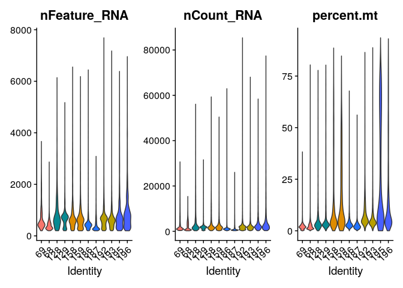<!-- -->

### Cell filtering

Based on the QC process we went through we can come to the following
conclusions:

-   Two samples present high mitochondrial gene counts.
-   There are some cells with a very low and very high number of
    features. These might point to non-informative cells and doublets
    respectively.

In the M&M of the publication\], the authors do not describe the
thresholds used to filter cells. Observing the distribution of the
plots, we suggest a threshold of \< 10% mitochondrial counts and \> 200
features per cell. To filter against possible doublets, here, we also
filter out cells with \> 2000 detected features/cell. Filtering `Seurat`
objects can be done with the `subset` method for class `SeuratObject`:

``` r
merged_seurat_filt <- subset(merged_seurat, subset = nFeature_RNA > 200 & 
                               nFeature_RNA < 2000 &
                               percent.mt < 10)
```

We can compare the number of filtered cells:

``` r
cbind(table(merged_seurat$orig.ident),table(merged_seurat_filt$orig.ident))
```

    ##             [,1]  [,2]
    ## GSM3972009  3739  3553
    ## GSM3972010 11488 11199
    ## GSM3972013  3273  2756
    ## GSM3972014  2743  2155
    ## GSM3972017  5534  3339
    ## GSM3972018  6237  3009
    ## GSM3972021  6423  6007
    ## GSM3972022  3010  2952
    ## GSM3972025  9073  6357
    ## GSM3972026 10537  8970
    ## GSM3972027  4666  1844
    ## GSM3972028  3893  2088

To evaluate this did the trick we can visualize those parameters again
in a violin plot:

``` r
VlnPlot(merged_seurat_filt, features = c("nFeature_RNA","nCount_RNA","percent.mt"),pt.size = 0,split.by = "Patient")
```

<!-- -->

``` r
#we remove non filtered seurat object
rm(merged_seurat)
```

# Normalization and Scaling

The preprocessing step of `normalization` aims to adjust the raw counts
in the dataset for variable sampling effects by scaling the observable
variance to a specified range. Several normalization techniques are used
in practice varying in complexity. By default, Seurat employs a
global-scaling normalization method “LogNormalize” that normalizes the
feature expression measurements for each cell by the total expression,
multiplies this by a scale factor (10,000 by default), and
log-transforms the result. Normalized values are stored in the “RNA”
assay (as item of the @assay slot) of the seu object.

We next identify the `highly variable features` (i.e, they are highly
expressed in some cells, and lowly expressed in others). Focusing on
these genes in downstream analysis helps to highlight biological signal
in single-cell datasets and reduces computational cost. Seurat’s
procedure directly models the mean-variance relationship inherent in
single-cell data, and is implemented in the FindVariableFeatures()
function. By default, the function returns 2,000 features per dataset.
These will be used in downstream analysis, like PCA.

Next, we apply `scaling`, a linear transformation that is a standard
pre-processing step prior to dimensional reduction techniques like PCA.
The ScaleData() function shifts the expression of each gene, so that the
mean expression across cells is 0 and the variance across cells is 1.
This step gives equal weight in downstream analyses, so that
highly-expressed genes do not dominate. The results of this are stored
in <seu$RNA@scale.data> By default, only variable features are scaled.

We can also use the ScaleData() function to remove unwanted sources of
variation from a single-cell dataset. For example, we could
`regress out` heterogeneity associated with (for example) cell cycle
stage, or mitochondrial contamination.
[Here](https://satijalab.org/seurat/articles/cell_cycle_vignette) you
can find a tutorial to regress out cell cycle scores.

For advanced users, there is an alternative normalization workflow,
SCTransform(), described
[here](https://satijalab.org/seurat/articles/sctransform_vignette), that
does not rely on the assumtion that each cell originally contains the
same number of RNA molecules. The use of SCTransform replaces the need
to run NormalizeData, FindVariableFeatures, or ScaleData. Also, as with
ScaleData(), the function SCTransform() also includes a vars.to.regress
parameter.

``` r
merged_seurat_filt <- NormalizeData(merged_seurat_filt)
merged_seurat_filt <- FindVariableFeatures(merged_seurat_filt)
merged_seurat_filt <- ScaleData(merged_seurat_filt) # needs some RAM
```

# Dimentionality reduction

## Perform linear dimensional reduction

Next we perform PCA on the scaled data. By default, only the previously
determined variable features are used as input, but can be defined using
features argument if you wish to choose a different subset (if you do
want to use a custom subset of features, make sure you pass these to
ScaleData first).

For the first principal components, Seurat outputs a list of genes with
the most positive and negative loadings, representing modules of genes
that exhibit either correlation (or anti-correlation) across
single-cells in the dataset.

``` r
merged_seurat_filt <- RunPCA(merged_seurat_filt)
```

## Determine the ‘dimensionality’ of the dataset

The elbowplot can help you in determining how many PCs to use for
downstream analysis such as UMAP, by finding the flattening point
(elbow) in which the majority of true signal is captured. However, a
useful automatic way to determine the optimal number of principal
components (PCs) to retain is depicted below:

``` r
ElbowPlot(merged_seurat_filt)
```

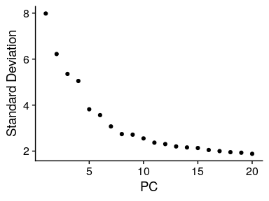<!-- -->

``` r
# Calculate optimal number of PC to use for the clustering
pct <- merged_seurat_filt[["pca"]]@stdev / sum(merged_seurat_filt[["pca"]]@stdev) * 100
cumu <- cumsum(pct)
# Find the first PC where cumulative variance > 90% and the PC itself explains < 5% of the variance
co1 <- which(cumu > 90 & pct < 5)[1]
# Find the first PC where the drop in variance explained between consecutive PCs is > 0.1%
co2 <- sort(which((pct[1:length(pct) - 1] - pct[2:length(pct)]) > 0.1), decreasing = T)[1] + 1
# Take the more conservative estimate (lower value) between the two
co3 <- min(co1, co2) # 11
```

## Run non-linear dimensional reduction (UMAP/tSNE)

``` r
merged_seurat_filt <- RunUMAP(merged_seurat_filt, reduction="pca", dims=1:co3, reduction.name = "umap.unintegrated")
merged_seurat_filt <- RunTSNE(merged_seurat_filt, reduction="pca", dims=1:co3, reduction.name = "tsne.unintegrated")

saveRDS(merged_seurat_filt, file.path(data_dir, "merged_data_filt.Rds"))
```

``` r
# We can compare between PCA, UMAP and tSNE methods
DimPlot(merged_seurat_filt, reduction = "pca")
```

<!-- -->

``` r
DimPlot(merged_seurat_filt, reduction = "umap.unintegrated")
```

<!-- -->

``` r
DimPlot(merged_seurat_filt, reduction = "tsne.unintegrated")
```

<!-- -->

``` r
#We can explore the different metadata and identify the need to integrate
DimPlot(merged_seurat_filt, reduction = "umap.unintegrated",group.by = c("Patient","Chemistry","status"))
```

<!-- -->

# Integration

Seurat v5 enables streamlined integrative analysis using the
IntegrateLayers function. The method currently supports five integration
methods. Each of these methods performs integration in low-dimensional
space, and returns a dimensional reduction (i.e. integrated.rpca) that
aims to co-embed shared cell types across batches:

-   Anchor-based CCA integration (method=CCAIntegration)
-   Anchor-based RPCA integration (method=RPCAIntegration)
-   Harmony (method=HarmonyIntegration)
-   FastMNN (method= FastMNNIntegration)
-   scVI (method=scVIIntegration)

Note that our anchor-based RPCA integration represents a faster and more
conservative (less correction) method for integration.

``` r
# Integrate
dwIntegrated <- IntegrateLayers(
  object = merged_seurat_filt, method = RPCAIntegration,
  orig.reduction = "pca", new.reduction = "integrated.rpca",
  verbose = TRUE
)

#Run dimensionality reduction on integrated.rpca
dwIntegrated <- RunUMAP(dwIntegrated, reduction="integrated.rpca", dims=1:co3, reduction.name = "umap.integrated")

# save integrated object
saveRDS(dwIntegrated, file.path(data_dir, "integrated_data.Rds"))
```

Evaluate with UMAP if the integration removed the technical effects:

``` r
DimPlot(dwIntegrated, reduction = "umap.integrated",group.by = "Sample_ID")
```

<!-- -->

``` r
DimPlot(dwIntegrated, reduction = "umap.integrated",group.by = c("Patient","Chemistry","status"))
```

<!-- -->

``` r
# Remove uninegrated object
rm(merged_seurat_filt)
```

# Cell clustering and annotation

The method implemented in Seurat first constructs a SNN graph based on
the euclidean distance in PCA space, and refine the edge weights between
any two cells based on the shared overlap in their local neighborhoods
(Jaccard similarity). This step is performed using the FindNeighbors()
function, and takes as input the previously defined dimensionality of
the dataset.

To cluster the cells, Seurat next implements modularity optimization
techniques such as the Louvain algorithm (default) or SLM \[SLM, Blondel
et al., Journal of Statistical Mechanics\], to iteratively group cells
together, with the goal of optimizing the standard modularity function.
The FindClusters() function implements this procedure, and contains a
resolution parameter that sets the ‘granularity’ of the downstream
clustering, with increased values leading to a greater number of
clusters.

``` r
dwIntegrated <- FindNeighbors(dwIntegrated, reduction="integrated.rpca", dims=1:co3) # reduce k.param and dims to make it quicker
dwIntegrated <- FindClusters(dwIntegrated, resolution=0.5) # try different resolutions
saveRDS(dwIntegrated, file.path(data_dir, "integrated_data.Rds"))
```

``` r
Idents(dwIntegrated) <- dwIntegrated$seurat_clusters
DimPlot(dwIntegrated, reduction = "umap.integrated",label=T)
```

<!-- -->

``` r
ggsave("Single_Cell_Transcriptomics_Seurat_files/Dimplot_seurat_clusters.pdf",width = 6,height = 5 )
```

## Use reference markers

``` r
cat('\n')  
```

``` r
cat('### Mithochondrial genes and unique genes', '\n') 
```

### Mithochondrial genes and unique genes

``` r
FeaturePlot(dwIntegrated, features = c("percent.mt", "nFeature_RNA"),reduction = "umap.integrated")
```

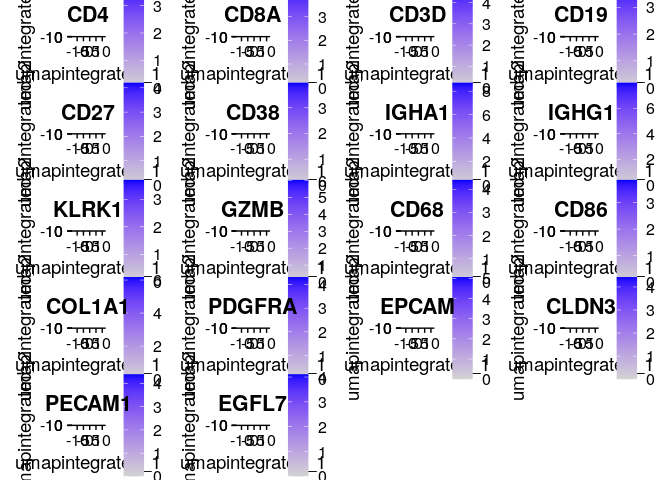<!-- -->

``` r
cat('\n') 
```

``` r
cat('\n')  
```

``` r
cat('### Generic immune cell markers', '\n') 
```

### Generic immune cell markers

``` r
FeaturePlot(dwIntegrated, features = c("PTPRC", "ITGAM", "CD3D", "CD19"),reduction = "umap.integrated")
```

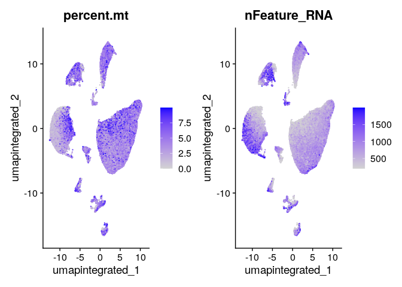<!-- -->

``` r
cat('\n') 
```

``` r
cat('\n')  
```

``` r
cat('### T cells', '\n') 
```

### T cells

``` r
FeaturePlot(dwIntegrated, features = c("CD3D", "CD4", "CD8A"),reduction = "umap.integrated") 
```

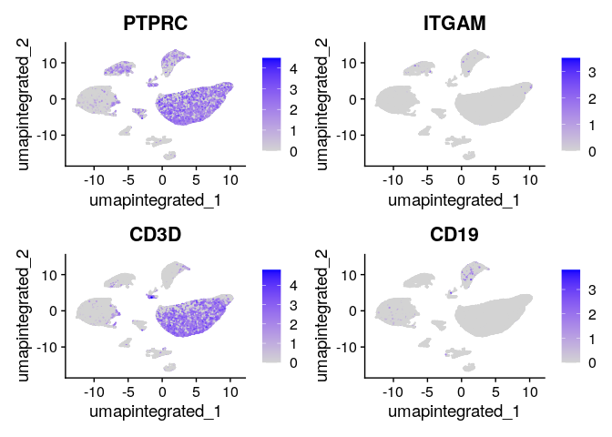<!-- -->

``` r
cat('\n') 
```

``` r
cat('\n')  
```

``` r
cat('### B cells', '\n') 
```

### B cells

``` r
FeaturePlot(dwIntegrated, features = c("CD3D", "CD19"),reduction = "umap.integrated") 
```

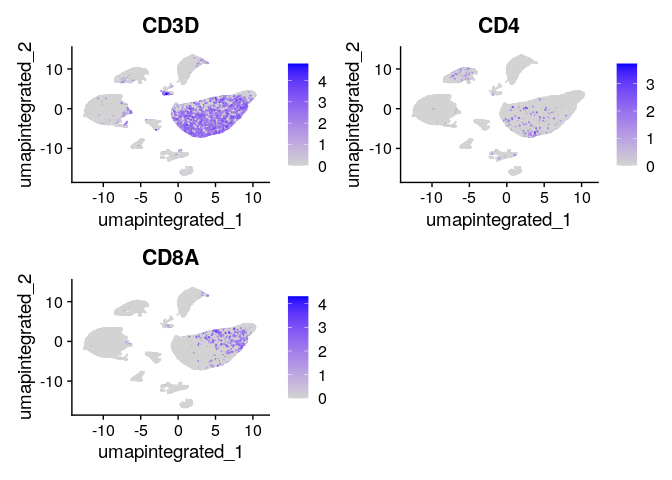<!-- -->

``` r
cat('\n') 
```

``` r
cat('\n')  
```

``` r
cat('### Plasma cells', '\n') 
```

### Plasma cells

``` r
FeaturePlot(dwIntegrated, features = c("CD27", "CD38","IGHA1","IGHG1"),reduction = "umap.integrated") 
```

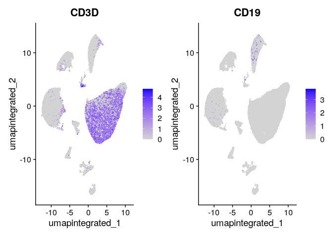<!-- -->

``` r
cat('\n') 
```

``` r
cat('\n')  
```

``` r
cat('### NK cells', '\n') 
```

### NK cells

``` r
FeaturePlot(dwIntegrated, features = c("KLRK1", "KLRD1", "PRF1", "GZMB"),reduction = "umap.integrated") 
```

<!-- -->

``` r
cat('\n') 
```

``` r
cat('\n')  
```

``` r
cat('### Monocytes/Macrophages', '\n') 
```

### Monocytes/Macrophages

``` r
FeaturePlot(dwIntegrated, features = c("CD68", "CD86", "MRC1", "CD14"),reduction = "umap.integrated")
```

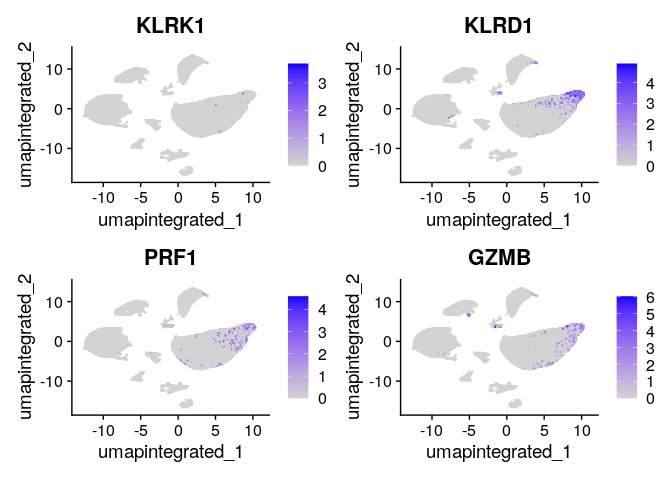<!-- -->

``` r
cat('\n') 
```

``` r
cat('\n')  
```

``` r
cat('### Fibroblasts', '\n') 
```

### Fibroblasts

``` r
FeaturePlot(dwIntegrated, features = c("COL1A1", "VIM", "CD248", "PDGFRA", "FAP"),reduction = "umap.integrated") 
```

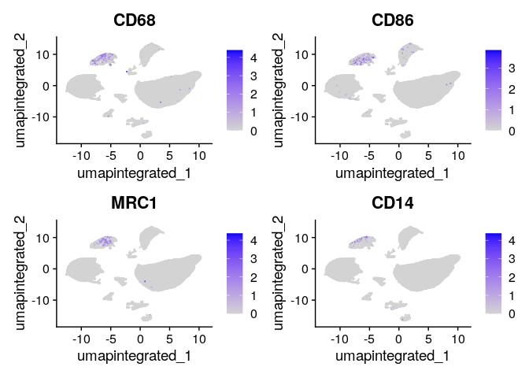<!-- -->

``` r
cat('\n') 
```

``` r
cat('\n')  
```

``` r
cat('### Neutrophils', '\n') 
```

### Neutrophils

``` r
FeaturePlot(dwIntegrated, features = c("IL1R2", "CXCR2", "MMP9" ),reduction = "umap.integrated") 
```

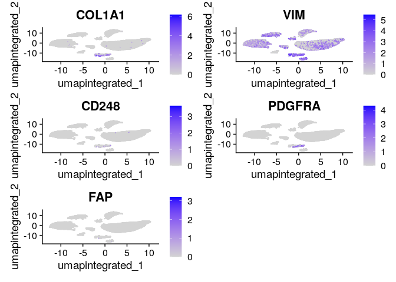<!-- -->

``` r
cat('\n') 
```

``` r
cat('\n')  
```

``` r
cat('### Epithelial cells', '\n') 
```

### Epithelial cells

``` r
FeaturePlot(dwIntegrated, features = c("CDH1", "EPCAM", "OCLN", "CLDN3", "CLDN7"),reduction = "umap.integrated")
```

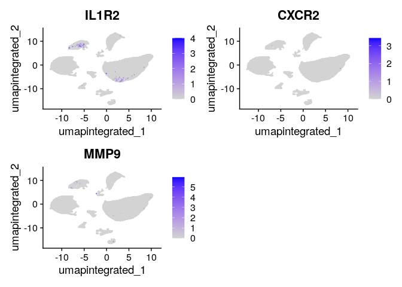<!-- -->

``` r
cat('\n') 
```

``` r
cat('\n')  
```

``` r
cat('### Endothelial cells', '\n') 
```

### Endothelial cells

``` r
FeaturePlot(dwIntegrated, features = c("PECAM1", "CD93", "EGFL7", "CDH5"),reduction = "umap.integrated")
```

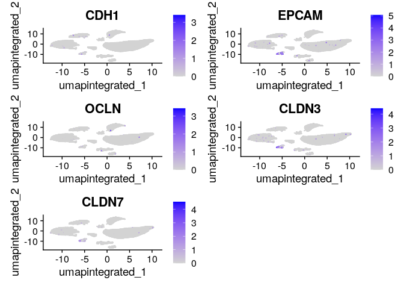<!-- -->

``` r
cat('\n') 
```

``` r
# Check Marker Genes with annother visualization
DotPlot(dwIntegrated, c("CD4", "CD8A", #Tecells
                        "CD3D", "CD19", #Bcells
                        "CD27", "CD38","IGHA1","IGHG1", #Plasma cells
                        "KLRK1", "GZMB", #NK
                        "CD68", "CD86", #Macrophages
                        "COL1A1", "PDGFRA",#Fibros
                        "EPCAM", "CLDN3", #Epithelial
                        "PECAM1", "EGFL7" #Endothelial
                        ),
        group.by = "seurat_clusters")+
  theme(axis.text.x=element_text(angle = 90))
```

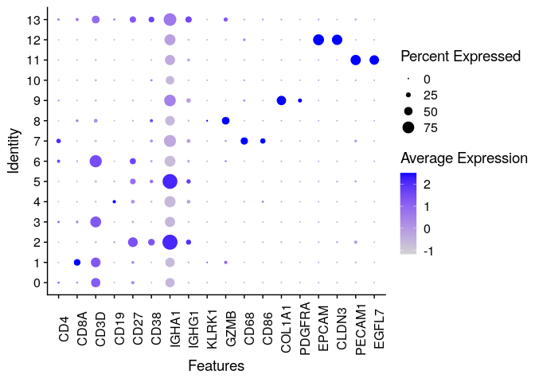<!-- -->

``` r
ggsave("Single_Cell_Transcriptomics_Seurat_files/Dotplot_seurat_clusters_markers.pdf",width = 10,height = 5)
```

## Cell type classification using a reference

``` r
library(SeuratData)
#InstallData("ifnb")
data("ifnb")
ifnb <- UpdateSeuratObject(ifnb)
ifnb <- subset(x = ifnb, subset = stim == "CTRL")
ifnb <- NormalizeData(ifnb)
ifnb <- FindVariableFeatures(ifnb)
ifnb <- ScaleData(ifnb)
ifnb <- RunPCA(ifnb)
ifnb <- RunUMAP(ifnb, reduction = "pca", dims = 1:15, reduction.name = "umap.pca")
DimPlot(ifnb,group.by = "seurat_annotations")


dwIntegrated <- JoinLayers(dwIntegrated, assay = "RNA")

ifnb.anchors <- FindTransferAnchors(reference = ifnb, query = dwIntegrated, dims = 1:15,reference.reduction = "pca")
predictions <- TransferData(anchorset = ifnb.anchors, refdata = ifnb$seurat_annotations, dims = 1:15)
dwIntegrated <- AddMetaData(dwIntegrated, metadata = predictions)

saveRDS(dwIntegrated, file.path(data_dir, "integrated_data.Rds"))
```

``` r
DimPlot(dwIntegrated,group.by = "predicted.id", reduction = "umap.integrated")
```

<!-- -->

``` r
ggsave("Single_Cell_Transcriptomics_Seurat_files/Dimplot_ifng_annotated.pdf")
```

    ## Saving 7 x 5 in image

With this information, we are ready to annotate clusters:

``` r
new_clusters = c("T cells CD4", #0
                 "T cells CD8", #1
                 "Plasma cells", #2
                 "T cells", #3
                 "B cells", #4
                 "Plasma cells", #5
                 "T cells", #6
                 "Monocytes", #7
                 "NKs", #8
                 "Fibroblasts", #9
                 "Unknown 1", # 10
                 "Endothelial", #11
                 "Epithelial", #12
                 "Unknown 2" )#13


names(new_clusters) <- levels(dwIntegrated)
new_clusters <- factor(new_clusters,levels=c("B cells","Plasma cells",  "Endothelial", "Epithelial", "Fibroblasts",
                                             "Monocytes", "NKs", "T cells", "T cells CD4", "T cells CD8", 
                                             "Unknown 1", "Unknown 2"))


dwAnnotated = RenameIdents(dwIntegrated, new_clusters)
dwAnnotated$custom_clusters = Idents(dwAnnotated)

# Save annotated object
saveRDS(dwAnnotated, file.path(data_dir, "integrated_data_annotated.Rds"))
```

``` r
colors <- c("#CDA087", "#A05555", "#91A096", "#D7D7C8", "#E1D2A5", "#AF7873", 
"#527C79", "#A5AA8C", "#D2B496", "#FFC996", "#E7C897", "#D5B4AA")

DimPlot(dwAnnotated,group.by = "custom_clusters", reduction = "umap.integrated",label = T,cols = colors)
```

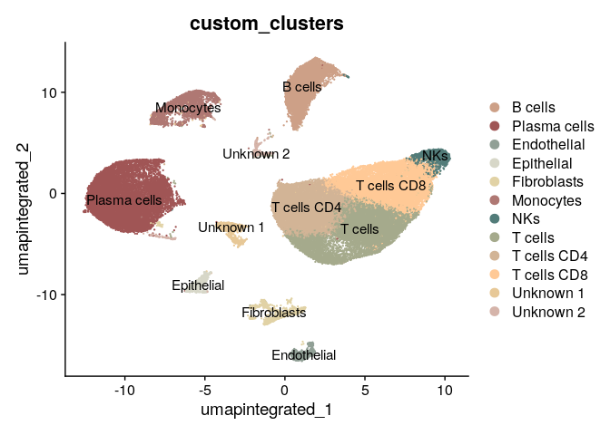<!-- -->

``` r
ggsave("Single_Cell_Transcriptomics_Seurat_files/Dimplot_seurat_annotated_v1.pdf")
```

``` r
library(dplyr)
```

    ## 
    ## Attaching package: 'dplyr'

    ## The following objects are masked from 'package:stats':
    ## 
    ##     filter, lag

    ## The following objects are masked from 'package:base':
    ## 
    ##     intersect, setdiff, setequal, union

``` r
prop_data <- dwAnnotated@meta.data %>%
  group_by(Sample_ID,Patient,status, custom_clusters) %>%
  summarise(count = n()) %>%
  group_by(Sample_ID) %>%
  mutate(proportion = count / sum(count)) %>%
  ungroup()
```

    ## `summarise()` has grouped output by 'Sample_ID', 'Patient', 'status'. You can
    ## override using the `.groups` argument.

``` r
prop_data$Patient <- as.factor(prop_data$Patient)
prop_data$Sample_ID <- as.factor(prop_data$Sample_ID)

# Plot by patient
ggplot(prop_data, aes(x = status, y = proportion, fill = custom_clusters)) +
  geom_bar(stat = "identity", position = "stack") +
  scale_fill_manual(values = colors) +
  facet_wrap(~ Patient, scales = "free_x")+
  labs(title = "Cell type proportions per sample",
       x = "Sample", y = "Proportion") +
  theme_minimal() 
```

<!-- -->

``` r
# Plot by status
ggplot(prop_data, aes(x = Patient, y = proportion, fill = custom_clusters)) +
  geom_bar(stat = "identity", position = "stack") +
  scale_fill_manual(values = colors) +
  facet_wrap(~ status, scales = "free_x")+
  labs(title = "Cell type proportions per sample",
       x = "Sample", y = "Proportion") +
  theme_minimal() 
```

<!-- -->

## FindAllMarkers

# Differential expression

Differential expression analysis is the process of identifying genes
that have a significant difference in expression between two or more
groups. For many sequencing experiments, regardless of methodology,
differential analysis lays the foundation of the results and any
biological interpretation.

Different tools can be used for differential gene expression analysis,
depending on the underlying statistics. One of the best known
statistical tests is the Student’s t-test, which tests for how likely it
is that two sets of measurements come from the same normal distribution.
However, this does assume that the data is normally distributed, meaning
that the data has the distinctive bell curve shape. Should this
assumption be inconsistent, a non-parametric version of this test is the
Wilcoxon rank-sum test, which tests how likely it is that one population
is larger than the other, regardless of probability distribution size.
Alternative distribution shapes can include bimodal or multimodal
distributions, with multiple distinct peaks, and skewed distributions
with data that favors one side or another.

For many sequencing experiments, the assumption of normality is rarely
guaranteed. Some of the more popular tools for bulk RNASeq experiments,
such as DESeq2, limma, and edgeR, acknowledge this, and use different
statistical models to identify and interpret differences in gene
expression. Single cell RNASeq is notorious for not having a normal
distribution of gene expression. For technical reasons, scRNASeq has a
transcript recovery rate between 60%-80%, which naturally skews the gene
expression towards the non-expressed end. The Seurat tool acknowledges
this, and by default uses the Wilcoxon rank-sum test to identify
differentially expressed genes.

## FindMarkers

``` r
df <- FindMarkers(dwAnnotated, ident.1 = "Involved", ident.2 = "Uninvolved", only.pos = F, verbose = T, min.pct = 0.1, logfc.threshold = 0.1)
```

## Pseudobulk Differential Expression

One particular critique of differential expression in single cell RNASeq
analysis is p-value “inflation,” where the p-values get so small that
there are far too many genes exist with p-values below 0.05, even after
adjustment. This is caused by the nature of scRNASeq, where each
individual cell essentially consists of a single replicate; as the
replicate count increases, the p-values tend to shrink. One method to
counter the p-value inflation is to run a pseudobulk analysis. In this
process, the total gene counts for each population of interest is
aggregated across cells, and then these total counts can be treated in
the same manner as a bulk RNASeq experiment.

``` r
pseudobulk <- AggregateExpression(object = dwIntegrated, group.by = c('predicted.id', 'status',"Patient"),return.seurat=T)
```
